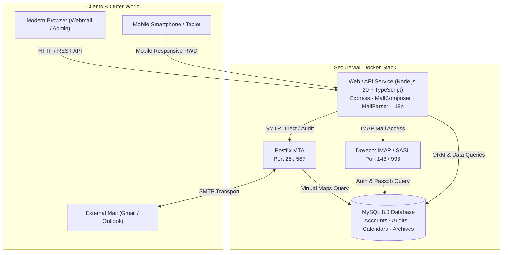

<div align="center">

# 📬 SecureMail Enterprise
### Modern, Secure, High-Performance Private Email Server & Webmail Platform

[](https://hub.docker.com/r/mozhenbear/securemail-web)
[](https://hub.docker.com/r/mozhenbear/securemail-web)
[-blueviolet?style=for-the-badge&logo=linux)](https://hub.docker.com/r/mozhenbear/securemail-web)
[](LICENSE)
[](https://github.com/mozhenbear/securemail/releases)

[](https://www.typescriptlang.org/)
[](https://nodejs.org/)
[](https://tailwindcss.com/)
[](http://www.postfix.org/)
[](https://www.dovecot.org/)
[](https://www.mysql.com/)

<br>

**[English](README.md) | [繁體中文](README.zh-TW.md) | [简体中文](README.zh-CN.md)**

<p align="center">
  <b>SecureMail</b> is an enterprise-grade, privacy-first private email server platform combining <b>Postfix (MTA)</b>, <b>Dovecot (IMAP/POP3)</b>, <b>MySQL 8.0</b>, and a modern <b>TypeScript Webmail</b> frontend. It delivers out-of-the-box multi-layer security audits, RFC 2387 inline CID rendering, Web DLP watermarking, RFC 5545 iCalendar meeting invitations, full compliance archiving, mobile responsive layout, and internationalization.
</p>

</div>

---

## 📸 Screenshots & Showcase

<div align="center">

### 💻 Modern Webmail Interface
*Clean, responsive 3-column desktop layout with instant mobile single-column drill-down*


### 🛡️ Enterprise Admin Console
*Comprehensive domain management, audit policies, compliance logs, LDAP sync & branding*


</div>

---

## 📊 Feature Comparison (SecureMail vs Alternatives)

| Feature / Capability | **SecureMail Enterprise** | **Mailcow: dockerized** | **iRedMail** | **Roundcube** | **Zimbra** |
| :--- | :---: | :---: | :---: | :---: | :---: |
| **Outbound Email Security Audit** | **✅ Built-in (7-Stage)** | ❌ None | 💰 Paid Pro only | ❌ None | ❌ None |
| **Web Beacon Anti-Tracking** | **✅ Vector Isolation** | ❌ None | ❌ None | ⚠️ Basic Blocker | ❌ None |
| **RFC 5545 Meeting Center & RSVP** | **✅ Native 2-Way Sync** | ⚠️ Basic SOGo | 💰 SOGo Plugin | ⚠️ Plugin required | ✅ Built-in |
| **Mobile Responsive (RWD)** | **✅ Native Drilldown** | ⚠️ Partial | 💰 Paid Skin | ⚠️ Theme required | ⚠️ Heavy |
| **Full Compliance WORM Archiving** | **✅ SHA-256 / Legal Hold** | ⚠️ Mail Piler Addon | 💰 Paid Pro only | ❌ None | 💰 Paid Network |
| **Web DLP Dynamic Watermark** | **✅ Native Anti-Leak** | ❌ None | ❌ None | ❌ None | ❌ None |
| **5s Undo Send & Scheduled Send** | **✅ Built-in** | ❌ None | ❌ None | ⚠️ Plugin required | ❌ None |
| **Memory Footprint** | **⚡ Ultra Light (< 300MB)** | 🐢 Heavy (4GB+ RAM) | ⚠️ Medium (2GB+ RAM) | ⚠️ Requires LAMP | 🐢 Very Heavy (8GB+ RAM) |
| **Docker Deployment** | **🚀 1 Command (`docker compose`)** | ⚠️ Complex scripts | ❌ Bare-metal script | ❌ Webmail only | ❌ Monolithic |
| **Multi-Language (i18n)** | **✅ EN / zh-TW / zh-CN** | ✅ Multi-lang | ✅ Multi-lang | ✅ Multi-lang | ✅ Multi-lang |

---

## ✨ Key Features

| Category | Highlights |
| :--- | :--- |
| **🛡️ Privacy & Security** | Web Beacon tracking blocker, Anti-Spam & Anti-Virus heuristics, Web DLP dynamic watermarking, TOTP 2FA, RFC 2387 MIME inline CID engine |
| **✉️ Modern Productivity** | 5s Undo Send countdown, Scheduled Send, Multi-signature manager & corporate templates, Cloud big-attachment transfer cards, Out-of-Office auto-responder |
| **⚖️ Enterprise Audit** | 7-stage outbound email inspection (keywords, recipients, attachment type/size, external recipient approval), manager leave delegation |
| **📅 Meetings & Directory** | RFC 5545 / RFC 6047 standard iCalendar meeting invitations with 1-click RSVP (Accept / Tentative / Decline), Corporate LDAP/AD sync & SSO (SAML 2.0 / OIDC) |
| **📱 Mobile Responsive** | Adaptive mobile layout, off-canvas folder drawer, single-column drilldown reader, bottom navigation bar |
| **📁 Folders & Workflow** | Custom folders lifecycle, 3-in-1 move integration (Context Menu, Batch Toolbar, Reader Actions), dynamic rules filtering |
| **🌐 Global Accessibility** | Built-in **English**, **Traditional Chinese (繁體中文)**, **Simplified Chinese (简体中文)** with automatic browser locale detection & global timezone conversion |

---

## 🚀 Quick Start (1-Minute Setup)

### 1. Prerequisites
- **Docker Engine**: 20.10+
- **Docker Compose**: v2.0+
- **Host Ports**: `25` (SMTP), `80/443` (Web), `143/993` (IMAP), `587` (Submission)

### 2. Download and Run
```bash
# Clone the repository
git clone https://github.com/mozhenbear/securemail.git
cd securemail

# Launch all services via Docker Compose
docker compose pull
docker compose up -d
```

### 3. Access Web Portals
- **Webmail Interface**: `http://localhost:33333` (or your configured domain)
- **Admin Console**: `http://localhost:33333/admin`
  - Default Admin Account: `admin`
  - Default Password: `admin123`

---

## 🏗 Architecture & Technology Stack



---

## 📄 License
This project is open-sourced under the **AGPL-3.0 License**. See the [LICENSE](LICENSE) file for details.
