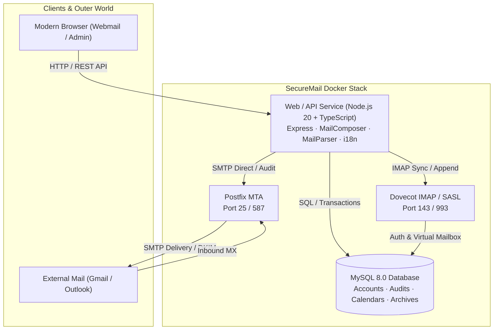

<div align="center">

# 📬 SecureMail Enterprise
### Modern, Secure, High-Performance Private Email Server & Webmail

[](https://hub.docker.com/r/mozhenbear/securemail-web)
[](https://hub.docker.com/r/mozhenbear/securemail-web)
[-blueviolet?style=for-the-badge&logo=linux)](https://hub.docker.com/r/mozhenbear/securemail-web)
[](LICENSE)
[](https://github.com/mozhenbear/securemail/releases)

[](https://www.typescriptlang.org/)
[](https://nodejs.org/)
[](https://tailwindcss.com/)
[](http://www.postfix.org/)
[](https://www.dovecot.org/)
[](https://www.mysql.com/)

<br>

**[English](README.md) | [繁體中文](README.zh-TW.md) | [简体中文](README.zh-CN.md)**

<p align="center">
  <b>SecureMail</b> is an enterprise-grade, privacy-first private email server platform combining <b>Postfix (MTA)</b>, <b>Dovecot (IMAP/POP3)</b>, <b>MySQL 8.0</b>, and a modern <b>TypeScript Webmail</b> frontend. It delivers out-of-the-box multi-layer security audits, RFC 2387 inline CID rendering, Web DLP watermarking, RFC 5545 iCalendar meeting invitations, full compliance archiving, and multi-language support.
</p>

---

</div>

## 📑 Table of Contents
- [✨ Key Features](#-key-features)
- [🚀 Quick Start (1-Minute Setup)](#-quick-start-1-minute-setup)
- [🏗 Architecture & Technology Stack](#-architecture--technology-stack)
- [🛡 Security & Privacy Innovations](#-security--privacy-innovations)
- [🌐 Internationalization (i18n) & Timezones](#-internationalization-i18n--timezones)
- [📋 DNS Configuration Checklist](#-dns-configuration-checklist)
- [📁 Folder Hierarchy & Management](#-folder-hierarchy--management)
- [👥 Admin Console & User Permissions](#-admin-console--user-permissions)
- [📄 License](#-license)

---

## ✨ Key Features

| Category | Highlights |
| :--- | :--- |
| **🛡️ Privacy & Security** | Web Beacon tracking blocker, Anti-Spam & Anti-Virus heuristics, Web DLP dynamic watermarking, TOTP 2FA, RFC 2387 MIME inline CID engine |
| **✉️ Modern Productivity** | 5s Undo Send countdown, Scheduled Send, Multi-signature manager & corporate templates, Cloud big-attachment transfer cards, Out-of-Office auto-responder |
| **⚖️ Enterprise Audit** | 7-stage outbound email inspection (keywords, recipients, attachment type/size, external recipient approval), manager leave delegation |
| **📅 Meetings & Directory** | RFC 5545 / RFC 6047 standard iCalendar meeting invitations with 1-click RSVP (Accept / Tentative / Decline), Corporate LDAP/AD sync & SSO (SAML 2.0 / OIDC) |
| **📁 Folders & Workflow** | Custom folders lifecycle, 3-in-1 move integration (Context Menu, Batch Toolbar, Reader Actions), dynamic rules filtering |
| **🌐 Global Accessibility** | Built-in **English**, **Traditional Chinese (繁體中文)**, **Simplified Chinese (简体中文)** with automatic browser locale detection & global timezone conversion |

---

## 🚀 Quick Start (1-Minute Setup)

### 1. Prerequisites
- **Docker Engine**: 20.10+
- **Docker Compose**: v2.0+
- **Host Ports**: `25` (SMTP), `80/443` (Web), `143/993` (IMAP), `587` (Submission)

### 2. Download and Run
```bash
# Clone the repository
git clone https://github.com/mozhenbear/securemail.git
cd securemail

# Launch all services via Docker Compose
docker compose pull
docker compose up -d
```

### 3. Access Web Portals
- **Webmail Interface**: `http://localhost:33333` (or your domain)
- **Admin Console**: `http://localhost:33333/admin`
  - Default Admin Account: `admin`
  - Default Password: `admin123`

---

## 🏗 Architecture & Technology Stack



---

## 🛡 Security & Privacy Innovations

1. **RFC 2387 MIME Multipart/Related CID Engine**:
   - Outbound base64 images are automatically transformed into RFC 2387 MIME inline attachments with unique `Content-ID` tags, ensuring 100% flawless rendering across **Gmail**, **Apple Mail**, **Outlook**, and **Thunderbird**.
2. **Web Beacon Anti-Tracking & Privacy Shield**:
   - External images are blocked by default to prevent sender reconnaissance; users can selectively whitelist trusted senders or load images for single viewing.
3. **Web DLP Dynamic Watermarking**:
   - Semi-transparent overlays displaying user identity, email address, and access timestamp prevent screen capture leaks.
4. **Outbound Compliance Audit & Deputy Delegation**:
   - Outbound emails matching sensitive keywords or external domains are held in an isolated approval queue with leave delegation capabilities.

---

## 🌐 Internationalization (i18n) & Timezones

SecureMail provides seamless native multilingual support:
- **Languages Supported**:
  - `zh-TW`: 繁體中文 (Traditional Chinese)
  - `zh-CN`: 简体中文 (Simplified Chinese)
  - `en`: English (Default fallback)
- **Smart Detection**: Automatically detects browser preferences via `navigator.languages`.
- **Instant Switcher**: Placed conveniently next to the timezone selector in the top navigation bar.
- **Timezone-Aware Architecture**: Millisecond UTC epoch timestamp comparisons across all audit and scheduling engines.

---

## 📋 DNS Configuration Checklist

For high deliverability and 100% inbox placement, configure the following DNS records for your domain:

| Type | Name / Host | Value | Purpose |
| :--- | :--- | :--- | :--- |
| **A** | `mail.yourdomain.com` | `<Your_Server_Public_IP>` | Mail Server Host Address |
| **MX** | `@` | `mail.yourdomain.com` (Priority 10) | Mail Routing Target |
| **TXT** | `@` | `v=spf1 mx ip4:<Your_Server_IP> ~all` | SPF Email Authentication |
| **TXT** | `_dmarc.yourdomain.com` | `v=DMARC1; p=quarantine; pct=100; rua=mailto:dmarc@yourdomain.com` | DMARC Protection |
| **TXT** | `default._domainkey` | `v=DKIM1; k=rsa; p=<YOUR_PUBLIC_KEY>` | DKIM Signature Verification |
| **PTR** | `<Reverse_IP>` | `mail.yourdomain.com` | Reverse DNS (Anti-Spam) |

---

## 📁 Folder Hierarchy & Management

SecureMail features a comprehensive folder lifecycle:
- **System Folders**: `INBOX`, `Drafts`, `Sent`, `Approval` (Pending Audit), `Approvaled` (Approved), `Rejected`, `Trash`, `Junk`, `Archive`.
- **3-in-1 Move Integration**:
  1. **Right-Click Context Menu**: Smart boundary detection preventing screen overflow.
  2. **Batch Toolbar**: Select multiple messages and move in one click.
  3. **Single Reader Dropdown**: Direct folder routing while viewing.

---

## 👥 Admin Console & User Permissions

- **Dedicated Admin Control Panel (`/admin`)**: Independent authentication decoupled from specific email domains.
- **Role-Based Access Control**: Assign `ROLE_ADMIN` permissions directly to user mailboxes or standalone admin accounts.
- **Immutable Compliance Archiving**: Tamper-proof legal hold storage with full-text search across all inbound and outbound emails.

---

## 📄 License

This project is licensed under the [GNU Affero General Public License v3.0 (AGPL-3.0)](LICENSE).
