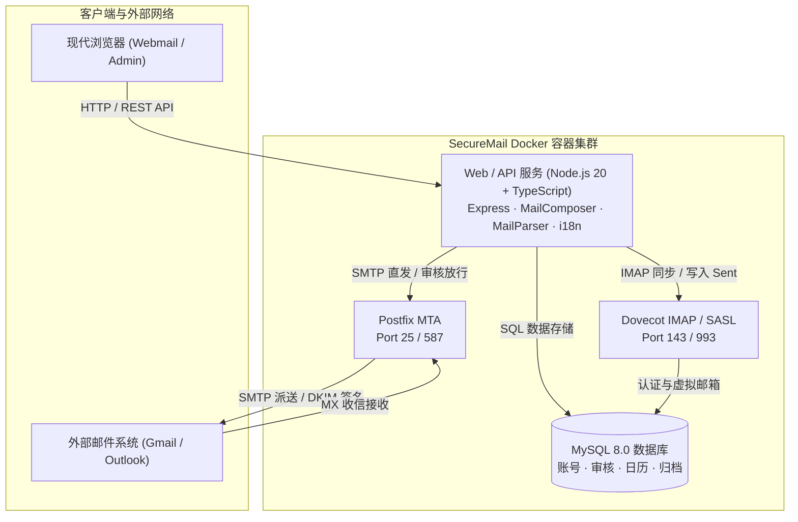

<div align="center">

# 📬 SecureMail 企业安全邮件系统
### 现代化、高安全、高性能企业级私有化邮件服务器与 Webmail

[](https://hub.docker.com/r/mozhenbear/securemail-web)
[](https://hub.docker.com/r/mozhenbear/securemail-web)
[-blueviolet?style=for-the-badge&logo=linux)](https://hub.docker.com/r/mozhenbear/securemail-web)
[](LICENSE)
[](https://github.com/mozhenbear/securemail/releases)

[](https://www.typescriptlang.org/)
[](https://nodejs.org/)
[](https://tailwindcss.com/)
[](http://www.postfix.org/)
[](https://www.dovecot.org/)
[](https://www.mysql.com/)

<br>

**[English](README.md) | [繁體中文](README.zh-TW.md) | [简体中文](README.zh-CN.md)**

<p align="center">
  <b>SecureMail</b> 是一套面向企业安全防护、隐私合规与现代协同办公的企业级私有化邮件系统。底层深度整合 <b>Postfix (MTA)</b>、<b>Dovecot (IMAP/POP3)</b>、<b>MySQL 8.0</b> 与现代 <b>TypeScript Webmail</b>，提供开箱即用的多维安全审核、RFC 2387 内嵌 CID 邮件图片渲染、Web DLP 防截屏水印、RFC 5545 iCalendar 会议邀请、全量合规归档与多语言即时切换支持。
</p>

---

</div>

## 📑 目录
- [✨ 核心特性](#-核心特性)
- [🚀 快速启动 (1 分钟 Docker 部署)](#-快速启动-1-分钟-docker-部署)
- [🏗 系统架构与技术栈](#-系统架构与技术栈)
- [🛡 安全与隐私防护亮点](#-安全与隐私防护亮点)
- [🌐 国际化多语言 (i18n) 与时区](#-国际化多语言-i18n-与时区)
- [📋 企业 DNS 解析配置清单](#-企业-dns-解析配置清单)
- [📁 文件夹管理与流转体系](#-文件夹管理与流转体系)
- [👥 系统管理后台与权限体系](#-系统管理后台与权限体系)
- [📄 开源许可协议](#-开源许可协议)

---

## ✨ 核心特性

| 功能模块 | 亮点概要 |
| :--- | :--- |
| **🛡️ 隐私与安全** | 外部图片防追踪拦截、Anti-Spam & 防毒特征评分、Web DLP 动态防泄密水印、TOTP 2FA、RFC 2387 MIME 内嵌 CID 图片引擎 |
| **✉️ 现代办公体验** | 发信 5 秒撤回 (Undo Send)、定时预发信、多签名管理与企业公版、超大附件云端分享卡片、休假自动回复 |
| **⚖️ 企业多维审核** | 7 阶段发信检核（敏感词、收件人上限、文件类型与大小、外网收件审核），支持主管差假代理人自动转派 |
| **📅 会议与组织通讯录** | RFC 5545 / RFC 6047 标准 iCalendar 会议邀请与一键出席回执（接受/暂定/谢绝），企业 LDAP/AD 同步与 SSO (SAML 2.0 / OIDC) |
| **📁 文件夹与自动规则** | 自定义文件夹全生命周期、三合一移动整合（右键菜单、批量操作条、阅读面板）、动态分类规则实时分流 |
| **🌐 全球多语言支持** | 内置 **简体中文**、**繁体中文**、**英文 (English)**，支持浏览器偏好自动识别与全局时区精准转换 |

---

## 🚀 快速启动 (1 分钟 Docker 部署)

### 1. 环境要求
- **Docker Engine**：20.10+
- **Docker Compose**：v2.0+
- **主机端口**：`25` (SMTP), `80/443` (Web), `143/993` (IMAP), `587` (Submission)

### 2. 下载与运行
```bash
# 克隆仓库
git clone https://github.com/mozhenbear/securemail.git
cd securemail

# 使用 Docker Compose 拉取并启动所有服务
docker compose pull
docker compose up -d
```

### 3. 系统访问
- **用户 Webmail 界面**：`http://localhost:33333` (或您的服务器域名)
- **系统管理控制台**：`http://localhost:33333/admin`
  - 默认管理员账号：`admin`
  - 默认登录密码：`admin123`

---

## 🏗 系统架构与技术栈



---

## 🛡 安全与隐私防护亮点

1. **RFC 2387 MIME Multipart/Related CID 引擎**：
   - 发送时自动将正文 Base64 转换为标准 MIME inline 附件并附加 `Content-ID`，彻底解决 **Gmail**、**Outlook**、**Apple Mail** 与 **Thunderbird** 邮件内嵌图片显示异常问题。
2. **Web Beacon 隐私防追踪**：
   - 默认拦截远程外链图片，防止发件方探测收件人的 IP 与开信行为；支持“本次加载”与“信任发件人并永久加载”。
3. **Web DLP 动态防截屏水印**：
   - 阅读区与附件预览区域动态叠加包含用户名、邮箱账号与访问时间的半透明水印，有效防止手机拍照外泄。
4. **多维度发信审核与差假代理**：
   - 触发外网审核、关键字或附件规则的邮件自动暂存审核队列，支持设置起止代理人协助审核。

---

## 🌐 国际化多语言 (i18n) 与时区

SecureMail 提供原生多语言支持：
- **支持语言**：
  - `zh-CN`：简体中文 (Simplified Chinese)
  - `zh-TW`：繁體中文 (Traditional Chinese)
  - `en`：English (英文 - 默认回退)
- **智能偏好识别**：根据 `navigator.languages` 自动适配用户浏览器语言。
- **快捷切换**：位于顶部导航栏时区菜单旁，即点即切。
- **全系统时区感知**：统一使用毫秒级 UTC 时间戳比对，跨国跨时区精准同步。

---

## 📋 企业 DNS 解析配置清单

为确保邮件顺利投递并不被标记为垃圾邮件，请在您的域名 DNS 控制台添加以下记录：

| 类型 | 主机记录 (Name) | 记录值 (Value) | 作用说明 |
| :--- | :--- | :--- | :--- |
| **A** | `mail.yourdomain.com` | `<服务器公网 IP>` | 邮件服务器主机地址 |
| **MX** | `@` | `mail.yourdomain.com` (优先级 10) | 邮件路由解析目标 |
| **TXT** | `@` | `v=spf1 mx ip4:<服务器公网 IP> ~all` | SPF 来源校验 |
| **TXT** | `_dmarc.yourdomain.com` | `v=DMARC1; p=quarantine; pct=100; rua=mailto:dmarc@yourdomain.com` | DMARC 防伪策略 |
| **TXT** | `default._domainkey` | `v=DKIM1; k=rsa; p=<您的公钥>` | DKIM 数字签名校验 |
| **PTR** | `<反向 IP>` | `mail.yourdomain.com` | 反向 DNS 解析 (防垃圾信必配) |

---

## 📁 文件夹管理与流转体系

SecureMail 具备完整的文件夹体系：
- **系统保留文件夹**：`收件箱 (INBOX)`、`草稿箱 (Drafts)`、`已发送 (Sent)`、`待审核 (Approval)`、`已审核通过 (Approvaled)`、`已拒绝发送 (Rejected)`、`垃圾箱 (Trash)`、`垃圾邮件 (Junk)`、`归档库 (Archive)`。
- **三合一移动整合**：
  1. **右键快捷菜单**：内置边界检测向上翻转，防止遮挡。
  2. **批量操作条**：多选邮件后一键快速归档。
  3. **阅读面板下拉**：直接在读信时分流至目标文件夹。

---

## 👥 系统管理后台与权限体系

- **独立管理控制台 (`/admin`)**：管理员账号与邮件域名完全解耦，删除测试域名不会影响管理员权限。
- **角色权限控制 (RBAC)**：支持在普通邮箱账号上一键赋予 `ROLE_ADMIN` 权限，或创建独立管理员。
- **合规归档审计库**：全量进出邮件只读存证，支持精准检索与原信导出。

---

## 📄 开源许可协议

本项目采用 [GNU Affero General Public License v3.0 (AGPL-3.0)](LICENSE) 许可协议发布。
