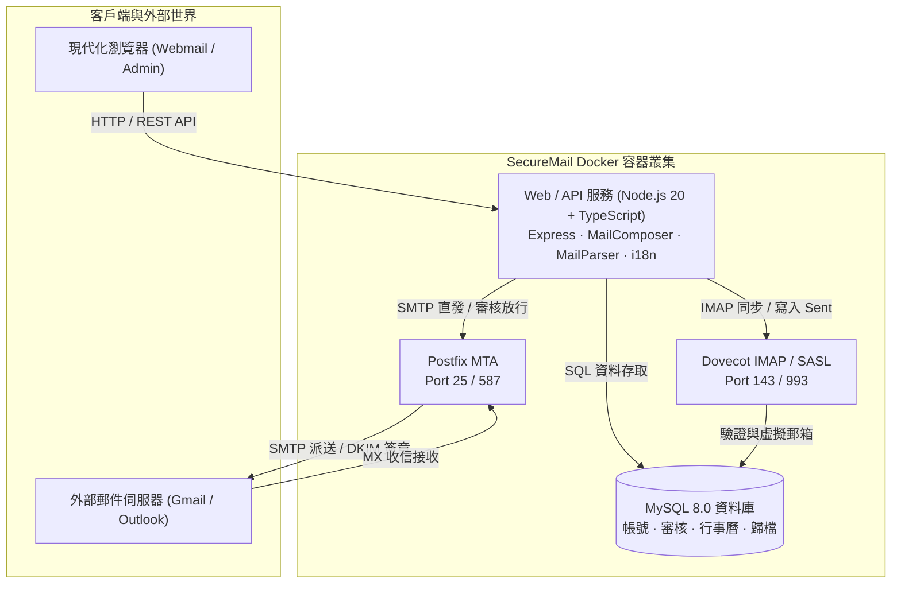

<div align="center">

# 📬 SecureMail 企業安全郵件系統
### 現代化、高安全、高效能企業級私有化郵件伺服器與 Webmail

[](https://hub.docker.com/r/mozhenbear/securemail-web)
[](https://hub.docker.com/r/mozhenbear/securemail-web)
[-blueviolet?style=for-the-badge&logo=linux)](https://hub.docker.com/r/mozhenbear/securemail-web)
[](LICENSE)
[](https://github.com/mozhenbear/securemail/releases)

[](https://www.typescriptlang.org/)
[](https://nodejs.org/)
[](https://tailwindcss.com/)
[](http://www.postfix.org/)
[](https://www.dovecot.org/)
[](https://www.mysql.com/)

<br>

**[English](README.md) | [繁體中文](README.zh-TW.md) | [简体中文](README.zh-CN.md)**

<p align="center">
  <b>SecureMail</b> 是一套針對企業安全防護、隱私控管與現代化辦公體驗的企業級私有化郵件平台。底層深度整合 <b>Postfix (MTA)</b>、<b>Dovecot (IMAP/POP3)</b>、<b>MySQL 8.0</b> 與現代化 <b>TypeScript Webmail</b>，提供開箱即用的多層安全審核、RFC 2387 內嵌 CID 圖片解析、Web DLP 浮水印、RFC 5545 iCalendar 會議邀請、全量合規歸檔與多語系切換支援。
</p>

---

</div>

## 📑 目錄
- [✨ 核心特色功能](#-核心特色功能)
- [🚀 快速啟動 (1 分鐘 Docker 部署)](#-快速啟動-1-分鐘-docker-部署)
- [🏗 系統架構與技術棧](#-系統架構與技術棧)
- [🛡 安全與隱私防護亮點](#-安全與隱私防護亮點)
- [🌐 國際化多語系 (i18n) 與時區](#-國際化多語系-i18n-與時區)
- [📋 企業 DNS 解析設定清單](#-企業-dns-解析設定清單)
- [📁 資料夾管理與移動體系](#-資料夾管理與移動體系)
- [👥 系統管理後台與權限體系](#-系統管理後台與權限體系)
- [📄 開源授權條款](#-開源授權條款)

---

## ✨ 核心特色功能

| 功能類別 | 亮點摘要 |
| :--- | :--- |
| **🛡️ 隱私安全防護** | 外部圖片防追蹤阻擋、Anti-Spam & 防毒特徵檢測、Web DLP 動態防洩密浮水印、TOTP 2FA、RFC 2387 MIME 內嵌 CID 圖片引擎 |
| **✉️ 現代化辦公體驗** | 發信 5 秒緩衝撤回 (Undo Send)、預約定時發信、多簽名檔管理與企業公版、超大附件雲端下載卡片、休假自動回覆 |
| **⚖️ 企業多層安全審核** | 7 階段發信檢核（敏感關鍵字、收件人上限、副檔名類型與大小、外網審核），支援主管差假代理人自動轉派 |
| **📅 會議與組織通訊錄** | RFC 5545 / RFC 6047 標準 iCalendar 會議邀請與一鍵 RSVP 回覆（接受/暫定/婉拒），企業 LDAP/AD 同步與 SSO (SAML 2.0 / OIDC) |
| **📁 資料夾與自動分類** | 自訂資料夾生命週期、全域三合一移動整合（右鍵選單、批次工具列、閱讀面板）、動態分類規則即時分流 |
| **🌐 全球多語系支援** | 內建 **繁體中文**、**簡體中文**、**英文 (English)**，支援瀏覽器語言自動偵測與全域毫秒級時區轉換 |

---

## 🚀 快速啟動 (1 分鐘 Docker 部署)

### 1. 環境需求
- **Docker Engine**：20.10+
- **Docker Compose**：v2.0+
- **主機通訊埠**：`25` (SMTP), `80/443` (Web), `143/993` (IMAP), `587` (Submission)

### 2. 下載與啟動
```bash
# 複製儲存庫
git clone https://github.com/mozhenbear/securemail.git
cd securemail

# 使用 Docker Compose 拉取並啟動所有容器
docker compose pull
docker compose up -d
```

### 3. 系統入口
- **用戶 Webmail 介面**：`http://localhost:33333` (或您的伺服器網域名稱)
- **系統管理控制台**：`http://localhost:33333/admin`
  - 預設管理員帳號：`admin`
  - 預設登入密碼：`admin123`

---

## 🏗 系統架構與技術棧



---

## 🛡 安全與隱私防護亮點

1. **RFC 2387 MIME Multipart/Related CID 引擎**：
   - 寄信時自動將內文 Base64 圖片轉換為標準 MIME inline 附件並附加 `Content-ID`，徹底解決 **Gmail**、**Outlook**、**Apple Mail** 與 **Thunderbird** 圖片無法顯示或破圖之問題。
2. **Web Beacon 隱私防追蹤橫幅**：
   - 預設攔截遠端外連圖片，防止寄件者探測收件者的 IP 與開信行為；支援「單次顯示」與「信任寄件者永久載入」。
3. **Web DLP 動態防洩密浮水印**：
   - 閱讀區與附件預覽區域動態疊加使用者姓名、信箱帳號與存取時間浮水印，有效遏止截圖或拍照外洩。
4. **多維度送審機制與差假代理人**：
   - 觸發外網審核、關鍵字或附件規則之郵件自動進入待審佇列，支援設定起訖代理人轉派審核。

---

## 🌐 國際化多語系 (i18n) 與時區

SecureMail 提供原生多語系架構：
- **支援語言**：
  - `zh-TW`：繁體中文 (Traditional Chinese)
  - `zh-CN`：简体中文 (Simplified Chinese)
  - `en`：English (英文 - 預設回退)
- **智慧偏好偵測**：透過 `navigator.languages` 自動識別瀏覽器慣用語言。
- **即時切換**：配置於頂部導航列時區選單旁，點擊即可無縫即時切換。
- **全域時區感知**：以 UTC 毫秒時間戳為核心比對基準，徹底消除跨時區計算誤差。

---

## 📋 企業 DNS 解析設定清單

為確保郵件發送成功率並避免進入垃圾信箱，請於您的網域 DNS 代管商處設定以下紀錄：

| 類型 | 主機名稱 (Name) | 設定值 (Value) | 目的說明 |
| :--- | :--- | :--- | :--- |
| **A** | `mail.yourdomain.com` | `<伺服器公網 IP>` | 郵件伺服器主機位址 |
| **MX** | `@` | `mail.yourdomain.com` (優先級 10) | 郵件路由指向 |
| **TXT** | `@` | `v=spf1 mx ip4:<伺服器公網 IP> ~all` | SPF 發信來源驗證 |
| **TXT** | `_dmarc.yourdomain.com` | `v=DMARC1; p=quarantine; pct=100; rua=mailto:dmarc@yourdomain.com` | DMARC 防偽保護政策 |
| **TXT** | `default._domainkey` | `v=DKIM1; k=rsa; p=<您的公鑰>` | DKIM 數位簽章防篡改 |
| **PTR** | `<反向 IP>` | `mail.yourdomain.com` | 反向 DNS 解析 (防垃圾信必備) |

---

## 📁 資料夾管理與移動體系

SecureMail 具備完整的資料夾管理體系：
- **系統保留資料夾**：`收件箱 (INBOX)`、`草稿箱 (Drafts)`、`已發送 (Sent)`、`待審核 (Approval)`、`已審核通過 (Approvaled)`、`已拒絕發送 (Rejected)`、`垃圾箱 (Trash)`、`垃圾郵件 (Junk)`、`封存庫 (Archive)`。
- **全域三合一移動整合**：
  1. **右鍵快捷選單**：內建視窗邊界偵測向上翻轉展開，防止遮擋。
  2. **批次操作列**：多選郵件後一鍵批次搬移。
  3. **閱讀面板下拉**：閱讀郵件時直接下拉快速分流。

---

## 👥 系統管理後台與權限體系

- **獨立系統管理後台 (`/admin`)**：後台管理員帳號與一般郵件網域完全解耦，刪除測試網域絕不影響管理員權限。
- **角色型存取控制 (RBAC)**：支援於一般郵件帳號上一鍵賦予 `ROLE_ADMIN` 後台權限或建立獨立管理員。
- **不可篡改之合規歸檔庫**：全量歸檔進出郵件，提供精確法規檢索與原信匯出。

---

## 📄 開源授權條款

本專案採用 [GNU Affero General Public License v3.0 (AGPL-3.0)](LICENSE) 授權發布。
