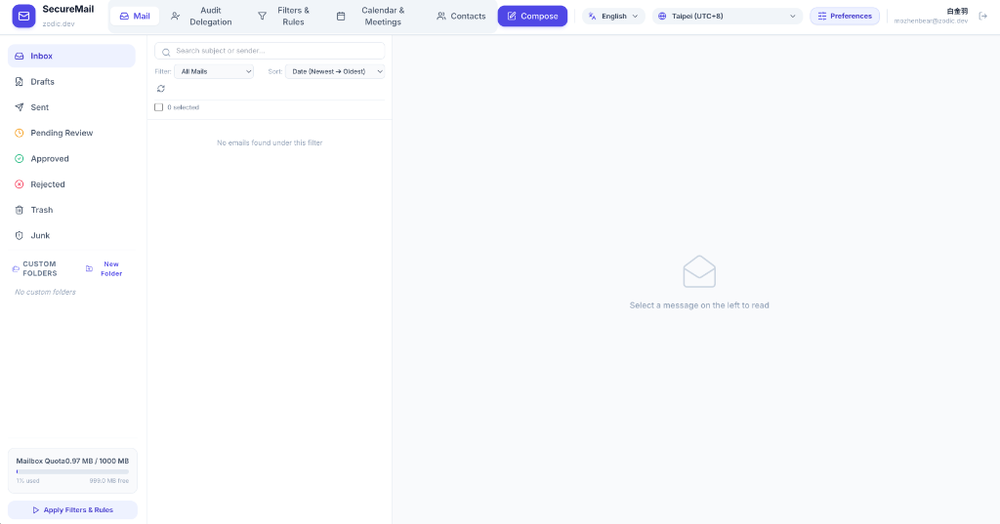
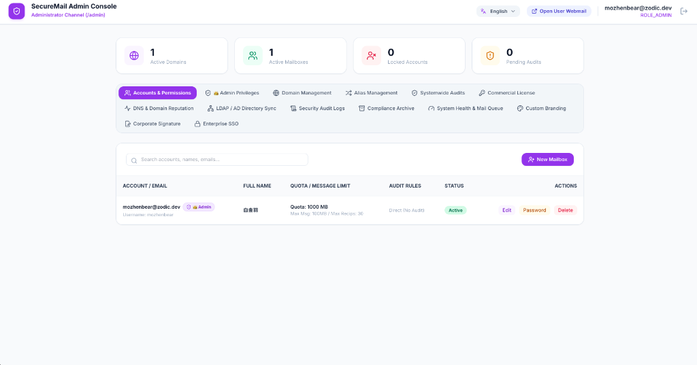

<div align="center">

# 📬 SecureMail 企業級安全郵件系統
### 現代化、高安全、輕量極速的私有郵件伺服器與 Webmail 平台

[](https://hub.docker.com/r/mozhenbear/securemail-web)
[](https://hub.docker.com/r/mozhenbear/securemail-web)
[-blueviolet?style=for-the-badge&logo=linux)](https://hub.docker.com/r/mozhenbear/securemail-web)
[](LICENSE)
[](https://github.com/mozhenbear/securemail/releases)

[](https://www.typescriptlang.org/)
[](https://nodejs.org/)
[](https://tailwindcss.com/)
[](http://www.postfix.org/)
[](https://www.dovecot.org/)
[](https://www.mysql.com/)

<br>

**[English](README.md) | [繁體中文](README.zh-TW.md) | [简体中文](README.zh-CN.md)**

<p align="center">
  <b>SecureMail</b> 是一套針對現代企業安全防護、機密審核、合規歸檔與極致操作體驗打造的企業級安全郵件平台。深度整合 <b>Postfix (MTA)</b>、<b>Dovecot (IMAP/POP3)</b>、<b>MySQL 8.0</b> 與現代化 <b>TypeScript Webmail</b>，開箱即用提供多層次郵件審核、Web Beacon 遠端圖片防追蹤、RFC 5545 標準會議邀請、全量合規歸檔、手機自適應與多國語系支援。
</p>

</div>

---

## 📸 介面展示 (Screenshots)

<div align="center">

### 💻 現代化 Webmail 操作介面
*簡潔流暢的電腦端三欄佈局，原生支援手機端單欄下鑽與滑動抽屜自適應*


### 🛡️ 企業管理後台 (Admin Console)
*網域帳號維護、多層審核規則、合規歸檔檢索、LDAP 同步與自訂企業品牌*


</div>

---

## 📊 主流郵件方案客觀規格對比矩陣

> *最後核實與更新時間：2026 年 8 月。依據各專案官方最新文檔、開源版本與公開發行規格進行客觀對比。*

| 功能特性 / 評測維度 | **SecureMail Enterprise** | **Mailcow: dockerized** | **iRedMail** | **Roundcube Webmail** | **Zimbra Collaboration** |
| :--- | :---: | :---: | :---: | :---: | :---: |
| **系統架構定位** | **完整伺服器 + 現代化 Webmail** | 完整伺服器 + SOGo 介面 | 完整伺服器 + 開源 Webmail | 僅為 Webmail 客戶端 (MUA) | 完整企業協作套件 |
| **企業外發郵件安全審核** | **✅ 內建 7 階段審核流程** | ❌ 無原生審核簽核佇列 | 💰 需加購 iRedAdmin-Pro | ❌ 無 (僅前端客戶端) | 💰 需加購 Network 商業版 |
| **遠端圖片隱私防追蹤** | **✅ 向量佔位安全隔離** | ⚠️ 基礎圖片阻擋 (SOGo) | ⚠️ 基礎圖片阻擋 | ✅ 原生「顯示圖片」開關 | ⚠️ 基礎圖片阻擋 |
| **RFC 5545 會議排程與 RSVP** | **✅ 原生雙向整合** | ✅ 原生支援 (SOGo CalDAV) | 💰 需 SOGo 組件支援 | ⚠️ 需安裝第三方外掛插件 | ✅ 原生內建支援 |
| **行動裝置手機自適應 (RWD)** | **✅ 原生單欄下鑽狀態機** | ⚠️ 響應式 SOGo 主題 | ⚠️ 需 Elastic 皮膚 / SOGo | ✅ 官方 Elastic 響應式皮膚 | ⚠️ Zimbra Modern UI |
| **全量合規歸檔庫 (WORM)** | **✅ 原生 SHA-256 / Legal Hold** | ⚠️ 建議外掛 Mailpiler | 💰 需加購 iRedAdmin-Pro | ❌ 無 (僅前端客戶端) | 💰 需加購 Network 商業版 |
| **Web DLP 動態防洩密浮水印** | **✅ 原生動態渲染防截圖** | ❌ 無 | ❌ 無 | ❌ 無 | ❌ 無 |
| **發信緩衝撤回與預約發信** | **✅ 內建 5s 撤回 / 背景定時** | ❌ 無 | ❌ 無 | ⚠️ 需安裝第三方外掛插件 | ❌ 無 |
| **系統建議記憶體佔用** | **⚡ 極致輕量 (< 300MB RAM)** | 🐢 需 4GB+ RAM (ClamAV/Solr) | ⚠️ 需 2GB - 4GB RAM | ⚡ 輕量 (需額外 LAMP/IMAP) | 🐢 需 8GB+ RAM 最低配置 |
| **Docker Compose 一鍵啟動** | **🚀 原生 `docker compose up -d`** | ✅ 原生 Docker 堆疊 | ❌ 腳本裸機安裝 | ❌ 僅提供 Webmail 容器 | ❌ 龐大單體安裝包 |
| **開源與授權模式** | **Open Core (免費社群 / 企業版)** | 開源 (GPL-3.0) | 開源基礎版 / 商業 Pro 後台 | 開源 (GPL-3.0) | 開源版 / 商業 Network 版 |

<details>
<summary><b>🔍 詳細規格說明與架構背景澄清</b></summary>

1. **Roundcube** 定位為純郵件網頁客戶端（MUA），本身不包含 Postfix/Dovecot 郵件服務，具備優秀的 Elastic 響應式皮膚與圖片阻擋，但外發審核、定時發信與歸檔需依賴額外後端與第三方插件。
2. **Mailcow: dockerized** 為成熟的 Docker 郵件伺服器套件，群組功能依賴 SOGo 提供 CalDAV/CardDAV，但不具備開箱即用的外發簽核審批流程與 WORM 合規存證（官方建議另行整合 Mailpiler）。
3. **iRedMail** 提供基礎開源安裝腳本，進階 Web 管理後台、外發隔離節流與郵件歸檔主要集中於商業版 *iRedAdmin-Pro*。
4. **Zimbra Collaboration** 為全功能企業套件，其深度 DLP 政策、Legal Hold 法規留存與備份等進階功能主要提供於商業 *Network Edition*。
5. **SecureMail** 將 MTA、IMAP 引擎、資料庫與響應式 TypeScript Webmail 深度整合為極輕量容器堆疊，原生內建 7 階段安全審核、Web Beacon 隱私隔離與動態防洩密浮水印。
</details>

--- | :---: | :---: | :---: | :---: | :---: |
| **企業外發郵件安全審核** | **✅ 內建 7 階段攔截** | ❌ 無 | 💰 需加購 Pro 版 | ❌ 無 | ❌ 無 |
| **遠端圖片隱私防追蹤** | **✅ 向量佔位安全隔離** | ❌ 無 | ❌ 無 | ⚠️ 基礎阻擋 | ❌ 無 |
| **RFC 5545 會議排程與 RSVP** | **✅ 原生雙向整合** | ⚠️ 基礎 SOGo | 💰 需外掛 SOGo | ⚠️ 需外掛插件 | ✅ 內建支援 |
| **行動裝置手機自適應 (RWD)** | **✅ 原生單欄下鑽** | ⚠️ 部分適配 | 💰 需付費皮膚 | ⚠️ 需自訂主題 | ⚠️ 介面厚重 |
| **全量合規歸檔庫 (WORM)** | **✅ SHA-256 / Legal Hold** | ⚠️ 需整合 Mail Piler | 💰 需加購 Pro 版 | ❌ 無 | 💰 需付費網路版 |
| **Web DLP 動態防洩密浮水印** | **✅ 原生動態渲染** | ❌ 無 | ❌ 無 | ❌ 無 | ❌ 無 |
| **發信緩衝撤回與預約發信** | **✅ 內建 5s 撤回/定時** | ❌ 無 | ❌ 無 | ⚠️ 需外掛插件 | ❌ 無 |
| **硬體資源記憶體佔用** | **⚡ 極致輕量 (< 300MB)** | 🐢 厚重 (需 4GB+ RAM) | ⚠️ 中等 (需 2GB+ RAM) | ⚠️ 需依賴 LAMP | 🐢 極厚重 (需 8GB+ RAM) |
| **Docker 一鍵部署** | **🚀 1 行指令 (`docker compose`)** | ⚠️ 設定腳本繁複 | ❌ 腳本裸機安裝 | ❌ 僅為前端 Web | ❌ 單體龐大難容器化 |
| **國際化多語系 (i18n)** | **✅ 繁中 / 簡中 / 英文** | ✅ 多語系 | ✅ 多語系 | ✅ 多語系 | ✅ 多語系 |

---

## ✨ 核心特色與商業亮點

| 領域分類 | 功能重點 |
| :--- | :--- |
| **🛡️ 隱私安全防護** | Web Beacon 遠端圖片追蹤阻擋、Anti-Spam/Virus 特徵過濾、Web DLP 動態浮水印、TOTP 雙因子驗證、RFC 2387 內嵌圖片引擎 |
| **✉️ 現代化辦公效率** | 發信 5 秒倒數一鍵撤回 (Undo Send)、預約定時發信、多簽名檔管理與企業公版範本、超大附件雲端下載卡片、休假自動回覆 |
| **⚖️ 企業多層審核** | 7 階段安全檢核 (關鍵字、收件人上限、附件大小與類型、外網審核)、主管差旅時區感知代理人指派 |
| **📅 會議中心與整合** | RFC 5545 / RFC 6047 標準會議邀請，支援 1 鍵回覆出席 (接受/暫定/婉拒)、企業 LDAP/AD 排程同步與 SSO 單一登入 |
| **📱 行動端手機自適應** | 智慧手機與平板最佳化排版、滑出式資料夾抽屜、單欄下鑽讀信與全螢幕寫信、常駐底部快捷導航列 |
| **📁 自訂資料夾與規則** | IMAP 自訂資料夾管理、3 合 1 移動整合 (右鍵選單、批次列、閱讀窗格)、多規則自動分類過濾引擎 |
| **🌐 全球化與多時區** | 內建**英文**、**繁體中文**、**簡體中文**，支援瀏覽器語言自動偵測與毫秒級時區雙向轉換 |

---

## 🚀 快速上手 (1 分鐘啟動)

### 1. 環境需求
- **Docker Engine**: 20.10+
- **Docker Compose**: v2.0+
- **本機連接埠**: `25` (SMTP), `80/443` (Web), `143/993` (IMAP), `587` (Submission)

### 2. 下載與啟動
```bash
# Clone 儲存庫
git clone https://github.com/mozhenbear/securemail.git
cd securemail

# 透過 Docker Compose 一鍵啟動所有服務
docker compose pull
docker compose up -d
```

### 3. 存取系統
- **使用者 Webmail 介面**: `http://localhost:33333` (或您的網域)
- **系統管理員後台**: `http://localhost:33333/admin`
  - 預設管理員帳號: `admin`
  - 預設管理員密碼: `admin123`

---

## 📄 開源授權
本專案基於 **AGPL-3.0 License** 開源發布，詳見 [LICENSE](LICENSE) 文件。
